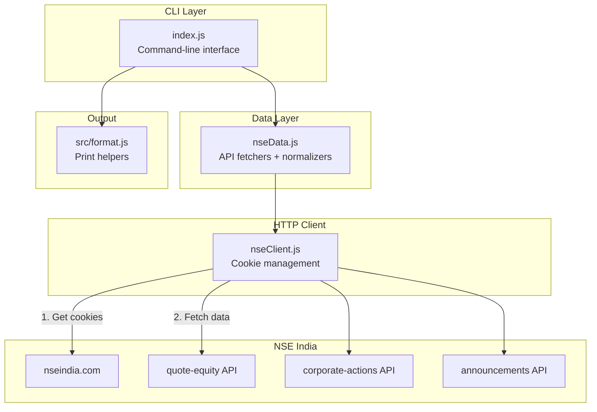
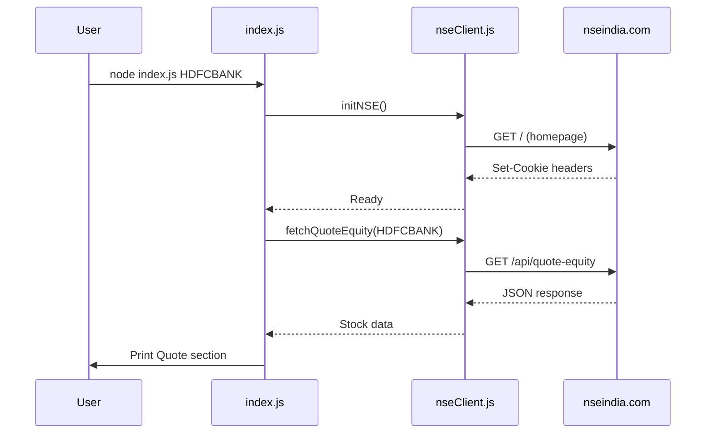

# NSE Stock Data Extractor

A simple Node.js CLI tool that fetches live stock data from NSE India (National Stock Exchange). It handles NSE's cookie-based authentication automatically, so you can fetch data without using a browser.

---

## What It Does

- Fetches live stock prices, P/E ratio, market cap, and more
- Gets corporate actions (bonus, dividend, stock splits)
- Gets company announcements
- Handles NSE's session cookies automatically
- Prints results as each API call completes (streaming output)

---

## Architecture



---

## How It Works

NSE blocks requests that don't have session cookies. So we:

1. First visit `https://www.nseindia.com` to get cookies
2. Use those cookies for all API calls

This happens automatically when you run the CLI.



---

## Project Files

| File | Purpose |
|------|---------|
| `index.js` | CLI entry point. Parses args, calls APIs, prints output |
| `nseData.js` | API fetch functions + data normalizers |
| `nseClient.js` | HTTP client with cookie jar and browser headers |
| `src/format.js` | Output formatting helpers |

---

## NSE API Endpoints Used

| Data | Endpoint | Notes |
|------|----------|-------|
| Stock Quote | `/api/quote-equity?symbol=X` | Price, P/E, market cap |
| Trade Info | `/api/quote-equity?symbol=X&section=trade_info` | Volume, delivery % |
| Corporate Actions | `/api/corporates-corporateActions?symbol=X&index=equities` | Bonus, dividend, splits |
| Announcements | `/api/corporate-announcements?symbol=X&index=equities` | Company news |
| Shareholding | `/api/shareholding-pattern?symbol=X&series=EQ` | Often returns 404 |

---

## Usage

### Basic Usage

```bash
node index.js HDFCBANK
```

### Debug Mode (show raw JSON)

```bash
node index.js HDFCBANK --raw
```

### Sample Output

```
Fetching data for HDFCBANK...


== Quote ==
Today Volume: 210.72
Deliverable %: 76.24
Volatility: null
CMP: 936.4
Day High: 942
Day Low: 929.6
52W High: 1020.5
52W Low: 812.15
Market Cap: 14406118105062.4
P/E (standalone): 19.55
Face Value: 1

== Corporate Actions ==
Latest: {"symbol":"HDFCBANK","series":"EQ","ind":"-","faceVal":"1","subject":"Bonus 1:1","exDate":"26-Aug-2025","recDate":"27-Aug-2025","bcStartDate":"-","bcEndDate":"-","ndStartDate":"-","comp":"HDFC Bank Limited","isin":"INE040A01018","ndEndDate":"-","caBroadcastDate":null}
shareholding failed: 404 Resource not found

== Announcements ==
Headline: null
```

---

## Troubleshooting

### Error: 403 Forbidden

**Cause:** NSE blocked the request (missing cookies or bad headers).

**Fix:** The client handles this automatically. If it persists, try:
- Wait a few seconds and retry
- Check if NSE website is accessible in your browser

### Error: 404 Resource not found

**Cause:** NSE endpoint doesn't exist or requires different parameters.

**Fix:** This is expected for some endpoints (like shareholding). The CLI continues and shows which API failed.

### Error: ETIMEDOUT or network errors

**Cause:** Network issue or NSE servers slow.

**Fix:** Check your internet connection and retry.

---

## Data Available

| Metric | Source |
|--------|--------|
| CMP (Current Price) | quote-equity |
| Day High / Low | quote-equity |
| 52W High / Low | quote-equity |
| Market Cap | quote-equity |
| P/E Ratio | quote-equity |
| Face Value | quote-equity |
| Today Volume | trade_info section |
| Deliverable % | trade_info section |
| Corporate Actions | corporates-corporateActions |
| Announcements | corporate-announcements |
| Shareholding | shareholding-pattern (often 404) |

---

## Dependencies

- `axios` - HTTP client
- `tough-cookie` - Cookie jar
- `axios-cookiejar-support` - Connect axios with tough-cookie
