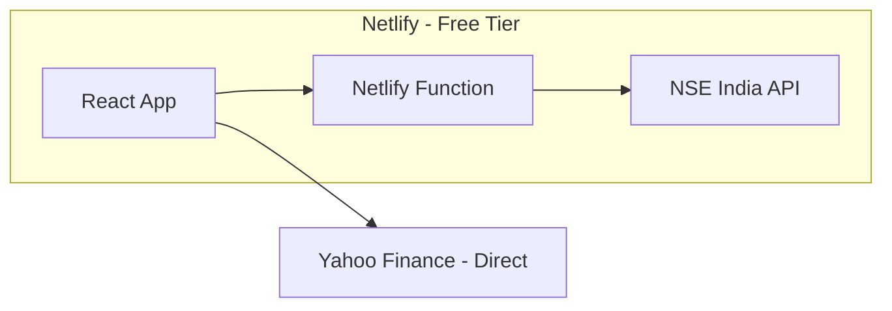

# Free Stock Data App - Complete API Comparison

## Your Data Requirements vs Free APIs

Legend: **Y** = Yes (pre-calculated), **C** = Need calculation, **N** = Not available

### 1. Price and Volume

| Data | NSE India | Yahoo Finance | Alpha Vantage | EODHD |
| --- | --- | --- | --- | --- |
| CMP | **Y** | **Y** | **Y** | **Y** |
| Day High/Low | **Y** | **Y** | **Y** | **Y** |
| 52-Week High/Low | **Y** | **Y** | **Y** | **Y** |
| Volume (today) | **Y** | **Y** | **Y** | **Y** |
| 10-day avg volume | **N** | **C** | **C** | **Y** |

### 2. Valuation Metrics

| Data | NSE India | Yahoo Finance | Alpha Vantage | EODHD |
| --- | --- | --- | --- | --- |
| P/E Ratio | **Y** | **Y** | **Y** | **Y** |
| Industry P/E | **Y** | **N** | **N** | **N** |
| P/B Ratio | **N** | **Y** | **Y** | **Y** |
| Face Value | **Y** | **N** | **N** | **N** |

### 3. Financial Strength

| Data | NSE India | Yahoo Finance | Alpha Vantage | EODHD |
| --- | --- | --- | --- | --- |
| Market Cap | **Y** | **Y** | **Y** | **Y** |
| Debt to Equity | **N** | **Y** | **Y** | **Y** |
| EPS (TTM) | **Y** | **Y** | **Y** | **Y** |
| ROE (%) | **N** | **Y** | **Y** | **Y** |
| ROCE (%) | **N** | **N** | **N** | **N** |

### 4. Growth and Profitability

| Data | NSE India | Yahoo Finance | Alpha Vantage | EODHD |
| --- | --- | --- | --- | --- |
| Revenue growth YoY | **N** | **C** | **C** | **C** |
| Net profit growth YoY | **N** | **C** | **C** | **C** |
| Operating margin | **N** | **Y** | **Y** | **Y** |

### 5. Shareholding Pattern

| Data | NSE India | Yahoo Finance | Alpha Vantage | EODHD |
| --- | --- | --- | --- | --- |
| Promoter holding % | **Y** | **N** | **N** | **N** |
| Promoter change (QoQ) | **Y** | **N** | **N** | **N** |
| FII holding % | **Y** | **N** | **N** | **N** |
| DII holding % | **Y** | **N** | **N** | **N** |
| Public holding % | **Y** | **N** | **N** | **N** |

### 6. Corporate Signals

| Data | NSE India | Yahoo Finance | Alpha Vantage | EODHD |
| --- | --- | --- | --- | --- |
| Recent results date | **Y** | **N** | **N** | **N** |
| Corporate actions | **Y** | **Y** | **N** | **Y** |
| Announcements | **Y** | **N** | **N** | **N** |---

## Coverage Summary (Pre-calculated only, no calculations)

| API | Coverage | Free Tier Limits | CORS Support |
| --- | --- | --- | --- |
| **NSE India** | 18/23 (78%) | Unlimited* | No (need proxy) |
| **Yahoo Finance** | 14/23 (61%) | Unlimited | Yes |
| **Alpha Vantage** | 12/23 (52%) | 25/day | Yes |
| **EODHD** | 13/23 (57%) | 20/day | Yes |*NSE has rate limiting but no hard daily cap---

## Critical Finding: NSE is the Best Source

**NSE India API is the ONLY free source that provides:**

- Industry P/E (unique to NSE)
- Face Value (unique to NSE)
- Complete Shareholding Pattern (unique to NSE)
- Corporate Announcements (unique to NSE)

**But NSE has a problem**: No CORS support, requires cookie session---

## Solution: Hybrid with Netlify Functions (Free)

Since you want to deploy on Netlify and need NSE data, the best free approach:

**Why this works:**

- Netlify Functions = serverless, free tier includes 125k requests/month
- Function handles NSE cookie session and CORS bypass
- Yahoo Finance called directly from browser (CORS-friendly)
- GitHub/Netlify deployment = completely free

---

## What You Cannot Get Free (Anywhere)

These require calculation or paid APIs:

| Data | Workaround |
| --- | --- |
| ROCE | Must calculate: EBIT / Capital Employed |
| Revenue growth YoY | Must calculate from 2 quarters |
| Net profit growth YoY | Must calculate from 2 quarters |
| 10-day avg volume | Must average last 10 days |

**Honest assessment**: If you truly want zero calculations, you'll miss 4 data points (17% of your list).---

## Recommended Architecture

**Data Sources:**

- NSE India (via Netlify Function): Industry P/E, Face Value, Shareholding, Announcements, Corporate Actions
- Yahoo Finance (direct): P/B, D/E, ROE, Operating Margin

**Tech Stack:**

- Frontend: React + Vite (or vanilla JS)
- Hosting: Netlify (free tier)
- Serverless: Netlify Functions for NSE proxy
- No database needed

**Deployment:**

- Push to GitHub
- Connect to Netlify
- Auto-deploy on every push

---

## Alternative: Pure Client-Side (Accept Data Gaps)

If you want absolutely zero backend code:**Use only Yahoo Finance** (direct browser fetch):

- Coverage: 14/23 data points (61%)
- Missing: Industry P/E, Face Value, Shareholding, Announcements

**Deploy on GitHub Pages** (no functions needed)---

## My Recommendation

**Go with Netlify + Netlify Functions** because:

1. Still free (125k requests/month)
2. Gets you 78% coverage with NSE data
3. Single deployment (frontend + function together)
4. The function is ~20 lines of code, not a "real backend"